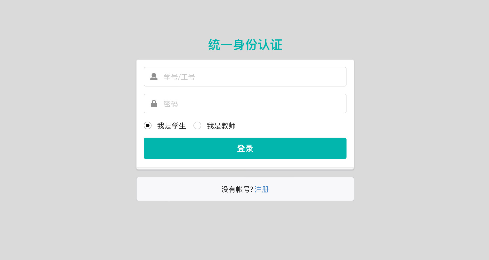
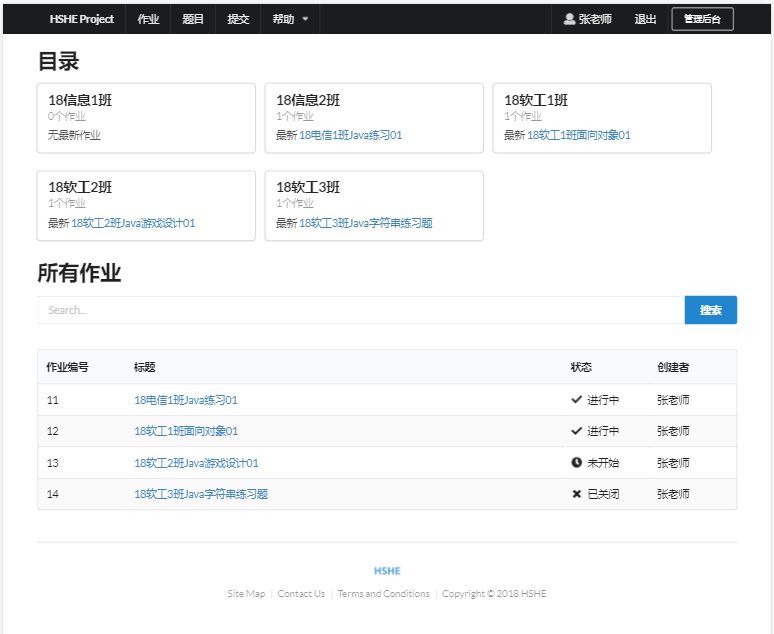
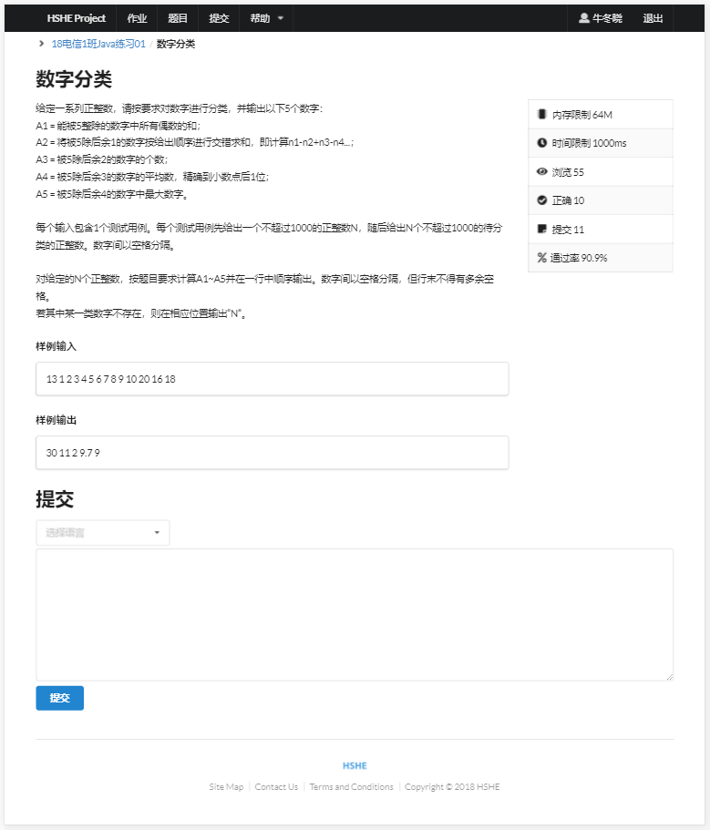
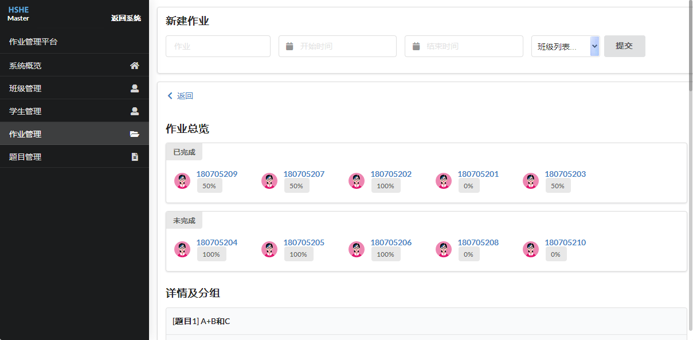
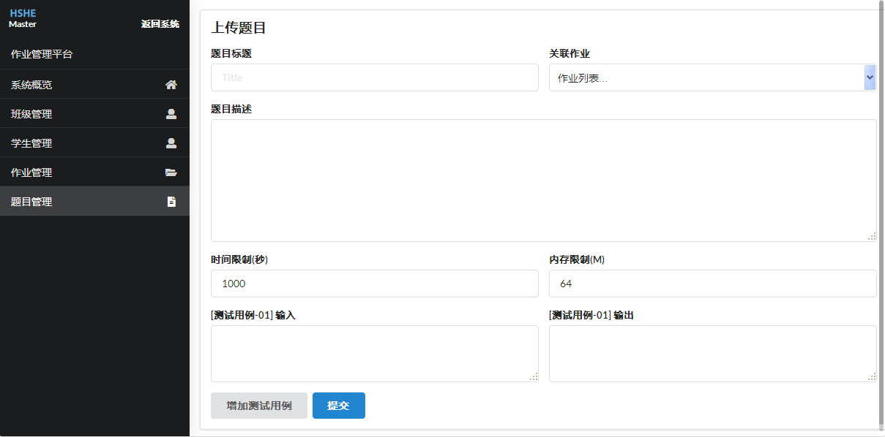
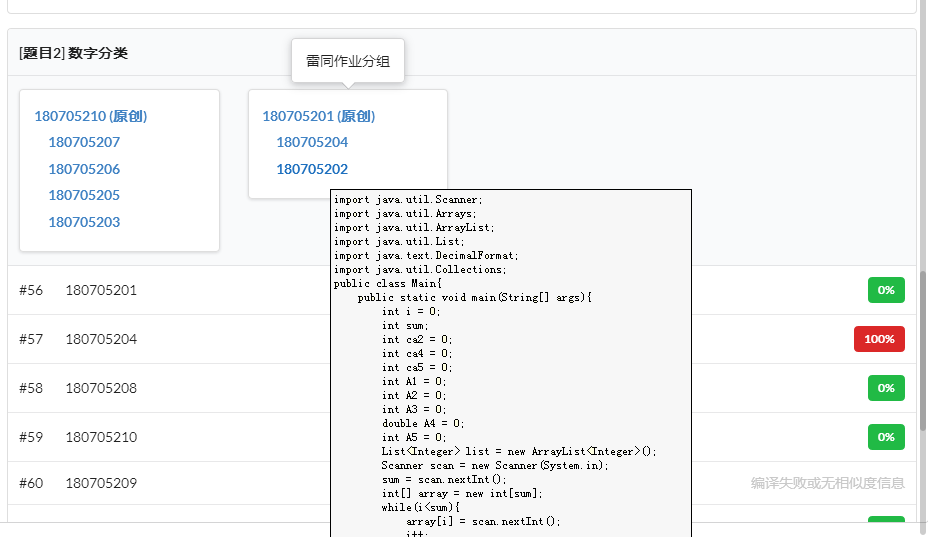
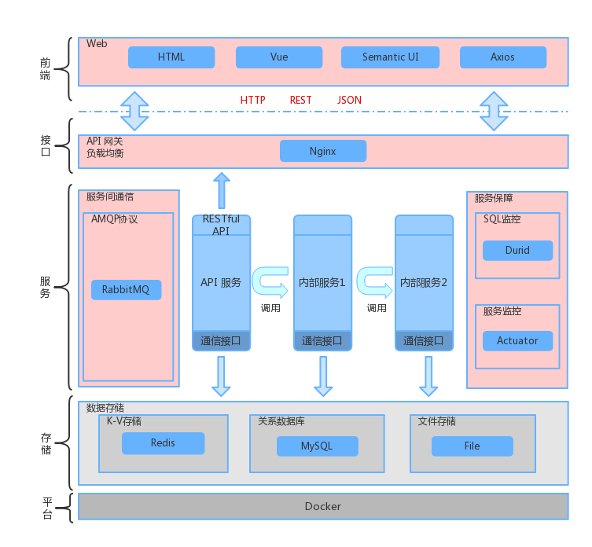

# HSHE 在线评测系统

主要使用 Spring Boot 开发 Web 前后台，评测模块和查重模块。评测模块内核使用 C++ 开发。使用垂直型的应用架构和分布式集群部署，服务间通过消息中间件通信。使用了前后端分离的开发模式，前端使用 Vue 框架开发 SPA 应用，后端 Web 模块全 RESTful API ，使用 Redis 做缓存，提供了良好的使用体验。部署使用Docker 容器，保证系统的安全性与可靠性。

## 部署

### 通过 Docker Compose 安装

项目已经被构建打包为多个 jar（存储在 `docker` 目录的子文件夹下），并由自动化脚本处理。所以，你可以一行命令运行起整个系统。（前提是部署环境安装了 Docker 和 [Docker Compose](https://docs.docker.com/compose/install/)）

#### 启动

```
cd docker/
docker-compose pull
./start-containers.sh
```

后续的依赖下载和部署过程大概需要等待3～5分钟，之后可以通过 `8080` 端口访问测试，可以使用如下账号

- Teacher: ID `00079888` Password `123456`
- Student: ID `180705202` Password `123456`

#### 停止

```
cd docker/
./kill-containers.sh
```

杀死并删除所有容器

### 手动安装

#### 安装依赖服务

在部署环境安装以下软件：

- Docker
- MySQL 5.6
- RabbitMQ 3.6
- Redis 4.0
- Nginx

#### 配置

- 部署环境创建数据目录

  ```
  mkdir -p /data/subs/
  mkdir -p /data/tests/
  ```

- 复制 judge_sim.sh（在这里 `docker/sim/judge_sim.sh` ）到部署环境 `/usr/local/bin` 下 

- 复制 sim302 目录（在这里 `docker/sim/sim302` ）到部署环境 `/usr/local` 下

- 在 `core`, `judge`, `sim` 子项目的 `application.properties` 中修改：
  - 相应服务的 `host`, `user`, `password` 等
  - 系统数据存储路径
  - 认证密钥等（建议设置为环境变量）

- 复制 Nginx 配置文件（在这里 `docker/web/nginx.conf`），并修改 `/api` 路由的 `proxy_pass` 为你的部署主机地址。然后复制 `static` 目录到部署环境的 `/hshe/static` 

- 运行 SQL 脚本，导入数据库 Demo 数据（在这里 `docker/mysql-dump/hshe-7-12.sql`）

#### 构建项目

[](https://travis-ci.com/shawnsky/hshe) **已通过测试的构建环境** CentOS 7、Ubuntu 18.04

在 `core`, `judge`, `sim` 目录中分别执行：

```
mvn clean package -DskipTests
```

#### 构建镜像

使用 Docker Java 8 基础镜像分别构建 3 个嵌入 jar 的镜像。Dockerfile 示例：

- core

  ```
  FROM java:8
  COPY . /usr/bin
  WORKDIR /usr/bin
  CMD ["java", "-jar", "core-0.0.1-SNAPSHOT.jar"]
  ```

- judge

  ```
  FROM java:8
  COPY . /usr/bin
  WORKDIR /usr/bin
  RUN useradd hshe -u 1000 -p "$(openssl passwd -1 hshepasswd)"
  USER hshe
  CMD ["java", "-jar", "judge-0.0.1-SNAPSHOT.jar"]
  ```

- sim

  ```
  FROM java:8
  COPY . /usr/bin
  WORKDIR /usr/bin
  CMD ["java", "-jar", "sim-0.0.1-SNAPSHOT.jar"]
  ```

  

在各自的 Dockerfile Context 下分别构建 3 个镜像：

```
docker build -t image-{core|judge|sim} .
```

#### 运行

启动容器

```
docker run -d -p 9000:9000  --name core  image-core
docker run -d --restart always -v /data/:/data/ --name judger1 image-judge
docker run -d --restart always -v /data/:/data/ --name judger2 image-judge
docker run -d -v /data/:/data/ -v /usr/local/sim_judge.sh:/usr/local/sim_judge.sh -v /usr/local/sim302/:/usr/local/sim302/ --name simer1 image-sim
```

启动 Nginx 服务器

```
/usr/local/nginx
```

## 运行截图

#### 用户登录

学生和教师使用同一登录入口，教师登录后会出现后台管理按钮。



#### 首页

展示系统内作业题目信息。



#### 题目界面

展示题目详情，输入和输出。由于评测服务器目前只安装了C编译器和JDK，暂时不能选择其他语言。



#### 提交结果

检查提交结果，同时显示资源占用情况。


#### 管理后台 

教师对班级、学生、作业的增删改管理。系统概览还可以查看目前各个评测机的运行状态。

**★ 加入了代码相似度分析（仅教师可见），比较并显示同一题目的某同学代码和其他同学代码的最高相似度，并把互相相似的代码作业标记为一组雷同作业。以帮助教师方便判定存在的作业抄袭情况。**







## 简易架构图



## 说明

项目目录中，`core` 是指后端API服务（命名不规范请见谅）；`judge` 是指后端评测服务，收到来自前端的代码提交调用后，通知 `judge` 模块对代码编译、运行、判定结果；`sim` 是指后端查重服务，其实就是对开源查重工具SIM的调用封装，若 `judge` 模块判定代码通过，会通知 `sim` 模块对代码进行查重，并更新结果。`static` 目录是前端项目，需要单独发布。

`judge` 和 `sim` 是内部服务，不提供外部调用入口，总体的调用顺序是 `core` -> `judge` -> `sim` ，但为了避免同步调用，所以才使用了 MQ 来做服务通信，同时启动多个 `judge` 和 `sim` 来消费，很大程度的提升了系统的性能和稳定性。

服务端运行来自用户的代码非常危险，因此服务运行于容器，保证了评测服务的安全。